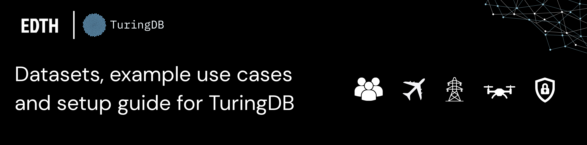

# TuringDB × EDTH Hackathon — Ready-to-Use Datasets & Use Cases

A ready-to-run pack of **graph datasets for the EDTH hackathon**, built on
[**TuringDB**](https://turing.bio). Clone this repo, point a TuringDB server at it, and you
have six domain graphs — supply chain, logistics risk, drone-swarm telemetry, global power
infrastructure, POLE crime investigation, and a cyber attack-scenario knowledge base —
loadable and queryable in seconds, plus a browser visualizer.

No data wrangling required: the graphs are **pre-built** and committed under [`graphs/`](graphs/).
Per-dataset documentation (schema, example queries, licensing) lives in [`docs/`](docs/).

> [!IMPORTANT]
> **These are just example datasets — you are not required to build on them.** They exist to
> get you querying in seconds, not to constrain your project. **Bring your own data**: take any
> **CSV or JSONL** file, turn it into a TuringDB graph with a short import script, and build on
> that instead. Mix the provided graphs with your own, or ignore these entirely — whatever fits
> your hack. See the [`turingdb` Claude Code skills](#claude-code-skills) (or the
> [Python SDK docs](https://docs.turingdb.ai/pythonsdk/reference)) for how to load your own
> CSV/JSONL into a graph.

---

## What is TuringDB?

TuringDB is a **high-performance, in-memory, column-oriented graph database engine** designed
for analytical and read-intensive workloads. Built from scratch in C++, it delivers
**millisecond query latency on graphs with millions of nodes and edges** — commonly **~200×
faster than Neo4j** on deep multi-hop queries.

### Key features

- **[Performance-first architecture](https://docs.turingdb.ai/concepts/columnar_storage)** —
  in-memory, column-oriented storage with streaming query processing; 0.1–50 ms latency on
  10M+ node graphs, [~200× faster than Neo4j](https://docs.turingdb.ai/benchmarks/results-summary)
  on deep multi-hop queries.
- **[Zero-lock concurrency](https://docs.turingdb.ai/concepts/zero_locking)** — reads and writes
  never compete; every transaction runs on its own immutable
  [snapshot](https://docs.turingdb.ai/concepts/snapshots) (snapshot isolation).
- **[Git-like versioning](https://docs.turingdb.ai/concepts/versioning_system)** — commit graph
  versions, branch, merge, and time-travel through history for reproducibility and auditability.
- **Developer friendly** — [OpenCypher](https://docs.turingdb.ai/query/cypher_subset) query
  language and a [Python SDK](https://docs.turingdb.ai/pythonsdk/reference) whose `query()`
  returns a pandas DataFrame, plus an HTTP server (`:6666`) and browser visualizer (`:8080`).

Each graph is a self-contained, versioned store (commits, dataparts) under `graphs/<name>/` —
which is exactly what this repo ships.

---

## Dataset catalog

| Graph | Domain | Nodes | Edges | Docs |
|---|---|--:|--:|---|
| `supply_chain` | Aerospace / defense supply chain (parts, suppliers, POs, quality incidents) | 30,380 | 90,402 | [docs/supply_chain.md](docs/supply_chain.md) |
| `logistics_risk` | Supply-chain **risk** & performance indicators (shipments, suppliers, countries, risk class) | 117,718 | 233,242 | [docs/logistics_risk.md](docs/logistics_risk.md) |
| `drone_swarm` | Drone-swarm coordination telemetry (positions, battery, formation, mission, trajectories) | 21,028 | 99,980 | [docs/drone_swarm.md](docs/drone_swarm.md) |
| `power_plants` | Global power infrastructure (plants, fuels, owners, countries) | 45,262 | 93,052 | [docs/power_plants.md](docs/power_plants.md) |
| `poledb` | POLE crime investigation (people, associates, crimes, officers, vehicles, phone calls, locations) | 61,521 | 105,840 | [docs/poledb.md](docs/poledb.md) |
| `attack_scenarios` | Cyber attack knowledge base (scenarios → MITRE ATT&CK techniques, tools, categories) | 18,354 | 60,014 | [docs/attack_scenarios.md](docs/attack_scenarios.md) |

---

## Example use cases

These graphs are picked for **defense, resilience, and intelligence** scenarios:

- **Supply-chain resilience** (`supply_chain`, `logistics_risk`) — trace a delayed purchase
  order or a quality defect back through the part to every affected site; find where high-risk
  shipments concentrate by supplier, product, and country; quantify supplier reliability
  (on-time-in-full) and single-source risk.
- **Critical-infrastructure mapping** (`power_plants`) — map generation capacity by country
  and fuel; identify ownership concentration and fuel-dependency for energy-security analysis.
- **Autonomous-systems / ISR** (`drone_swarm`) — reconstruct each drone's trajectory over
  time, correlate collision warnings with formation and mission, and snapshot the full swarm
  state at any instant.
- **Criminal-network / investigation analysis** (`poledb`) — map associates through `KNOWS`
  and family links, trace crimes to their location, investigating officer, suspects and
  vehicles, and reconstruct phone-call patterns across a person's contacts.
- **Attack knowledge base & ATT&CK mapping** (`attack_scenarios`) — pull full attack playbooks
  (steps, impact, detection, remediation), pivot from a MITRE ATT&CK technique to every attack
  that uses it, and rank the tools attackers rely on most.

Each dataset's doc lists concrete starter queries.

---

## Prerequisites

1. **TuringDB server** — the `turingdb` CLI on your `PATH`.
2. **Python SDK** (for querying):
   ```bash
   pip install turingdb
   ```

---

## Quick start

### 1. Start the server pointed at this repo

The repo root **is** a TuringDB "turing-dir" (it contains a `graphs/` store). Start the
server against it, with the visualizer enabled:

```bash
git clone https://github.com/turing-db/turingdb-hackathon-defense.git
cd turingdb-hackathon-defense

turingdb start -turing-dir "$(pwd)" -ui -ui-port 8080
```

- **`:6666`** — database (HTTP API used by the SDK)
- **`:8080`** — open <http://localhost:8080> for the interactive visualizer

> The server recreates its runtime dirs (`data/`, `logs/`, lock/socket) on first start — those
> are git-ignored. Only the `graphs/` store is versioned here.

### 2. Query from Python

```python
from turingdb import TuringDB

c = TuringDB("json", host="http://localhost:6666")

# pick a graph (see the catalog below)
c.load_graph("power_plants")
c.set_graph("power_plants")

# results come back as a pandas DataFrame
df = c.query("""
  MATCH (p:PowerPlant)-[:LOCATED_IN]->(co:Country {country_code:'USA'}),
        (p)-[:PRIMARY_FUEL]->(f:Fuel)
  RETURN p.name, f.name AS fuel, p.capacity_mw
  LIMIT 20
""")
print(df)
```

### 3. Explore in the visualizer

Open <http://localhost:8080>, choose a graph, and run the default
`MATCH (n) RETURN n LIMIT 100` to see a slice — then click nodes to expand neighbours.

---

## Claude Code skills

This repo bundles the [**TuringDB Claude Code skills**](https://github.com/turing-db/turingdb-skills)
under [`skills/turingdb/`](skills/turingdb) — they teach Claude Code how to start, query, write,
and manage TuringDB graphs (including the Cypher dialect's quirks), so you can drive these
datasets in plain English instead of memorizing the SDK.

Install with the skills CLI:

```bash
npx skills add https://github.com/turing-db/turingdb-skills
```

…or copy the bundled folder straight into your Claude Code skills directory:

```bash
cp -r skills/turingdb ~/.claude/skills/
```

Then start a Claude Code session and type `/turingdb` followed by what you want to do, e.g.:

- `/turingdb start the server at $(pwd) and load power_plants`
- `/turingdb query the highest-capacity plants in the USA with their fuel`
- `/turingdb find which suppliers have the most quality incidents in supply_chain`

| File | Covers |
|------|--------|
| `SKILL.md` | Entry point — routes to the right reference for your task |
| `startup.md` | Install the package, start the server, connect, load a graph |
| `querying.md` | `MATCH`, `WHERE`, joins, ordering, functions |
| `writing.md` | `CREATE`, `SET`, and the change/commit workflow |
| `algorithms.md` | Shortest path (Dijkstra), vector/embedding search |
| `introspection.md` | Explore schema, versioning, time travel, SDK reference |
| `parquet.md` | Import Parquet files via the `turing-parquet` CLI |

---

## Repo layout

```
turingdb-hackathon-defense/
├── README.md            ← you are here
├── graphs/              ← prebuilt, versioned TuringDB graph store (point -turing-dir here)
│   ├── default/         ← empty default graph (needed for a clean server start)
│   ├── supply_chain/
│   ├── logistics_risk/
│   ├── drone_swarm/
│   ├── power_plants/
│   ├── poledb/
│   └── attack_scenarios/
├── docs/                ← per-dataset schema, queries, and licensing
│   ├── supply_chain.md
│   ├── logistics_risk.md
│   ├── drone_swarm.md
│   ├── power_plants.md
│   ├── poledb.md
│   └── attack_scenarios.md
└── skills/              ← TuringDB Claude Code skills (/turingdb)
    └── turingdb/
```

---

## Licensing

Each dataset retains its **original source license** — see the "License" section in each
doc. Summary:

| Graph | Source license |
|---|---|
| `supply_chain` | MIT (synthetic data) |
| `logistics_risk` | Apache-2.0 |
| `drone_swarm` | CC BY 4.0 |
| `power_plants` | CC BY 4.0 (WRI Global Power Plant Database) |
| `poledb` | OGL v3.0 (UK open police data; synthetic personal entities) |
| `attack_scenarios` | MIT |

When redistributing, retain the relevant attribution/notice and indicate that the data was
converted into a TuringDB graph.
